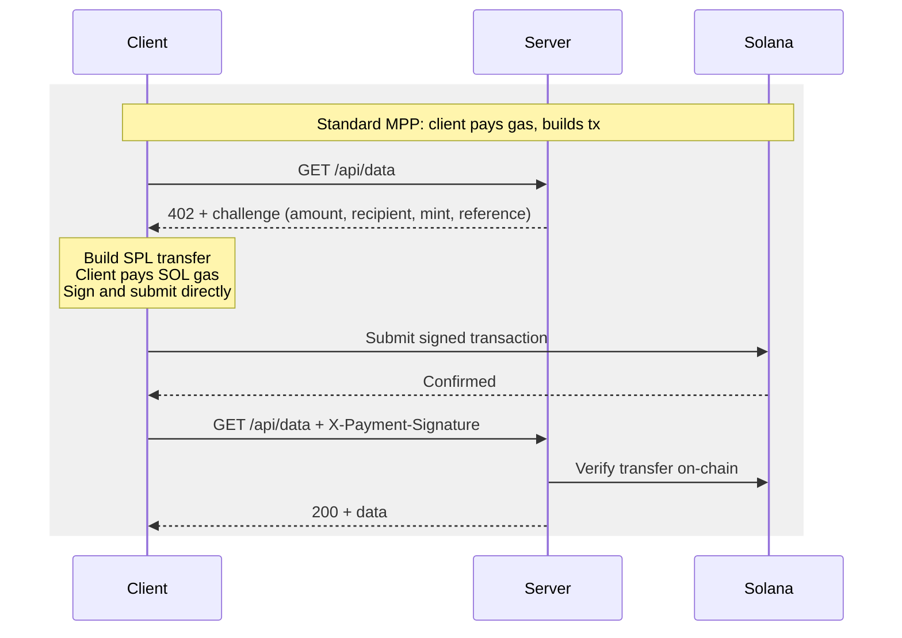
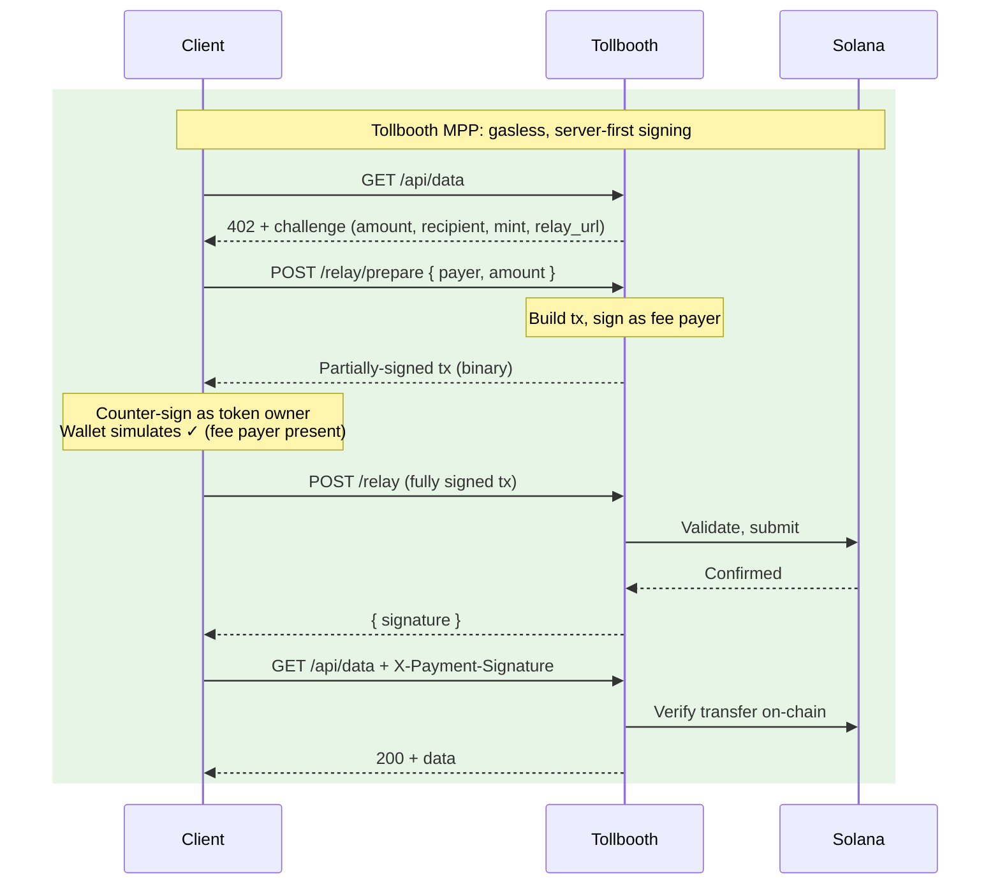
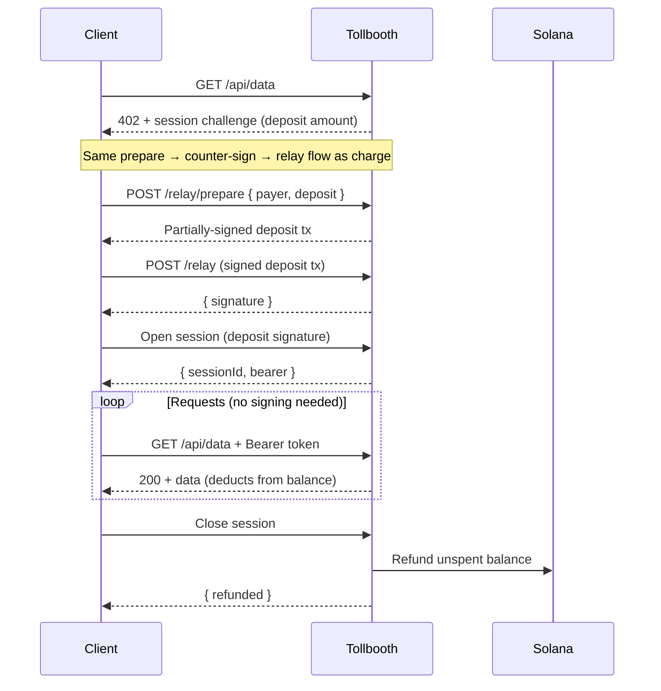
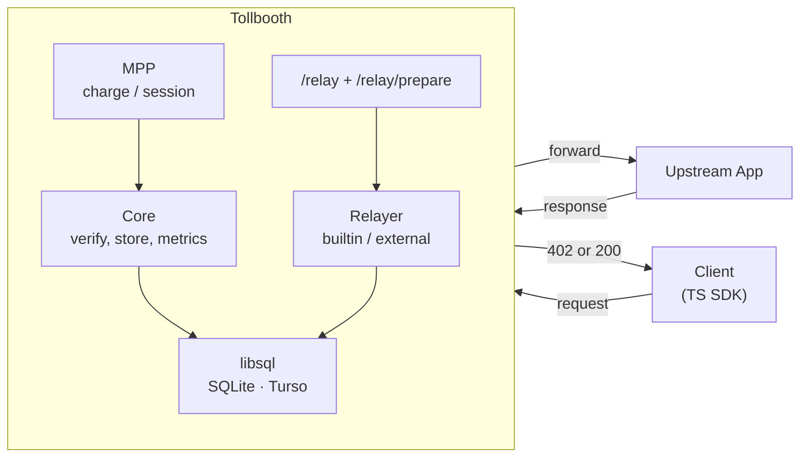

# Tollbooth

Solana payment gateway implementing [MPP](https://mpp.dev/) (Machine Payments Protocol) with a built-in fee relayer so clients never need SOL.

Ships three ways:

- **Reverse proxy binary** that payment-gates any backend (Python, Node, Go, whatever)
- **Rust library** (axum middleware) for Rust web servers
- **TypeScript client SDK** (`@spl-tollbooth/client`) for browser and Node

## Quickstart

```bash
# Generate a server keypair
cargo run -p spl-tollbooth-cli -- keygen --output keypair.json

# Create a config file
cargo run -p spl-tollbooth-cli -- init

# Edit tollbooth.toml with your recipient, mint, and RPC URL

# Start the proxy
cargo run -p spl-tollbooth-cli -- serve --config tollbooth.toml
```

Tollbooth sits in front of your API. Unpaid requests get a `402 Payment Required` with payment instructions. Clients call `/relay/prepare` to get a server-signed transaction, counter-sign with their wallet, submit via `/relay`, then retry with proof. Tollbooth verifies and forwards to your backend.

## How It Works

Tollbooth implements [MPP](https://mpp.dev/) with two extensions: a **fee relayer** (clients never need SOL) and **server-first signing** (wallets can simulate before the user approves).

### Standard MPP vs Tollbooth MPP





**What Tollbooth adds to MPP:**

| | Standard MPP | Tollbooth MPP |
|---|---|---|
| **Gas** | Client pays SOL | Server pays SOL (fee relayer) |
| **Who builds the tx** | Client | Server (`/relay/prepare`) |
| **Who signs first** | Client | Server (fee payer), then client counter-signs |
| **Wallet simulation** | Fails (no fee payer sig) | Works (fee payer already signed) |
| **Client needs** | SOL + token | Token only |
| **Submit path** | Client → Solana directly | Client → `/relay` → Solana |

### Session flow (prepaid balance)

For APIs where you make many requests, sessions avoid paying per call:



## TypeScript Client

```typescript
import { TollboothClient } from '@spl-tollbooth/client';

const client = new TollboothClient({
  wallet,                    // Phantom, wallet-adapter, Keypair
  protocol: 'mpp',
});

// Handles 402 automatically
const res = await client.fetch('https://api.example.com/joke');
const { joke } = await res.json();

// Session-based access
const session = await client.session('https://api.example.com/data');
const page1 = await session.fetch('/data?page=1');
const page2 = await session.fetch('/data?page=2');
await session.close(); // triggers refund of unused balance

// Persist and restore sessions (e.g., across page refreshes)
const snapshot = session.serialize();
localStorage.setItem('session', JSON.stringify(snapshot));

// Later, after page reload:
const saved = JSON.parse(localStorage.getItem('session')!);
const restored = TollboothSession.restore(client, saved, wallet);
// IMPORTANT: verify the session is still valid before trusting it
const check = await restored.fetch('/data?page=1');
if (!check.ok) { /* session expired or closed, start a new one */ }
```

## Rust Middleware

```rust
use axum::{Router, middleware, routing::get};
use spl_tollbooth_server::middleware::tollbooth_middleware;

let state: AppState = /* build with real MppCharge */;

let app = Router::new()
    .route("/api/joke", get(joke_handler))
    .layer(middleware::from_fn(move |request, next| {
        tollbooth_middleware(
            state.clone(),
            "/api/joke".into(),
            1_000,       // price in raw token units (0.001 USDC = 1000 @ 6 decimals)
            false,       // charge mode, not session
            request,
            next,
        )
    }))
    .with_state(state.clone());
```

The proxy binary (`tollbooth serve`) handles all of this automatically via `tollbooth.toml`. The middleware API is for embedding tollbooth in your own axum app.

## Configuration

`tollbooth.toml` drives the proxy binary. See [`tollbooth.example.toml`](tollbooth.example.toml) for the full reference.

Key sections:

```toml
[server]
listen = "0.0.0.0:3402"
upstream = "http://localhost:8080"    # your backend
# relay_url = "https://pay.example.com/relay"  # set in production

[solana]
recipient = "YourWa11etAddress..."   # where payments go
mint = "EPjFWdd5AufqSSqeM..."        # USDC (or any SPL token)
decimals = 6

[relayer]
mode = "builtin"                     # "builtin" | "external" | "disabled"
max_transfer_amount = 10000

[[routes]]
path = "/api/joke"
price = "0.001"
mode = "charge"                      # pay per call

[[routes]]
path = "/api/data/*"
price = "0.01"
mode = "session"                     # prepaid session
deposit = "0.1"
```

One mint per deployment. Need multiple tokens? Run separate instances.

**Why SPL tokens only, no native SOL:** Tollbooth's relayer pays SOL gas so users don't have to. With native SOL payments, the user's payment and the relayer's gas are the same denomination. You can't cleanly separate "user paying for a service" from "relayer subsidizing gas." SPL tokens keep these distinct: relayer spends SOL, user spends USDC. That's the whole point of gasless session payments.

## Architecture



Five Rust crates, layered bottom-up:

```
spl-tollbooth-core         types, config, store (libsql), metrics, webhooks, verify
  └─ spl-tollbooth-relayer   fee relayer (builtin signer + external Kora JSON-RPC)
  └─ spl-tollbooth-mpp       MPP protocol (charge + session + crash recovery)
      └─ spl-tollbooth-server   axum middleware + reverse proxy + /relay + /relay/prepare
          └─ spl-tollbooth-cli    standalone binary (serve/init/check/status/keygen)
```

TypeScript SDK in `sdks/ts/`.

## Storage

[libsql](https://github.com/tursodatabase/libsql) (SQLite-compatible):

| Environment | Config | Notes |
|-------------|--------|-------|
| Dev | `file:tollbooth.db` | Local SQLite, zero setup |
| Production | `libsql://mydb.turso.io` | [Turso](https://turso.tech) edge database |
| Tests | tempfile-backed | Isolated per test |

## Development

```bash
cargo build                    # build everything
cargo test                     # unit tests
cargo clippy --workspace       # lint

# integration tests (need solana-test-validator running)
cargo test --workspace -- --ignored

# TypeScript SDK
cd sdks/ts
bun install
bun test
```

## Security

- Relay validates transactions before signing (recipient allowlist, amount limits, blockhash freshness)
- Relay only exposes atomic sign-and-submit (no sign-without-send, prevents TOCTOU)
- Server-first signing: server builds the transaction, client can only counter-sign (no malicious instruction injection)
- Replay protection via UNIQUE constraint with idempotent cached receipts
- Bearer tokens: HMAC-SHA256, keyed with server secret, client-generated random (not derivable from public data)
- Session persistence (`serialize()`/`restore()`): the bearer is stored in plaintext. Treat it like any auth token in localStorage. Always verify a restored session with a server request before trusting it. Session balances are bounded by the deposit amount, limiting exposure.
- Multi-transfer transactions: every destination must be in the allowlist
- Address lookup table transactions rejected (prevents validation bypass)
- Webhook payloads signed with HMAC-SHA256
- Use HTTPS in production. The SDK trusts the relay URL and payment parameters from the 402 response.
- Built-in rate limiting is best-effort (per-pubkey + global cap). Deploy an IP-level limiter upstream for hard enforcement.

## License

MIT
